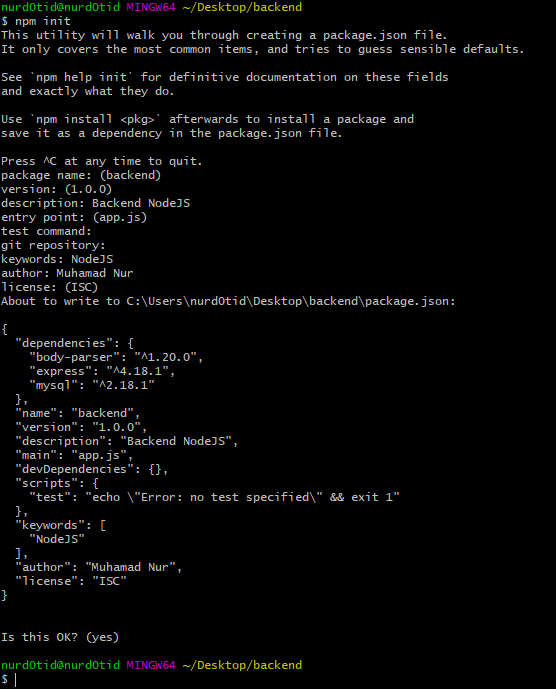
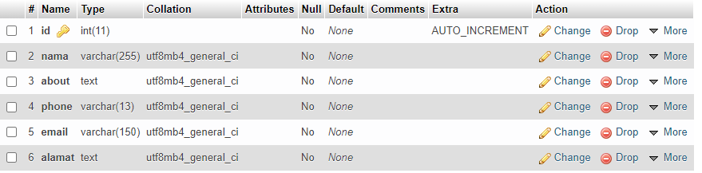
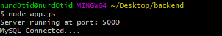
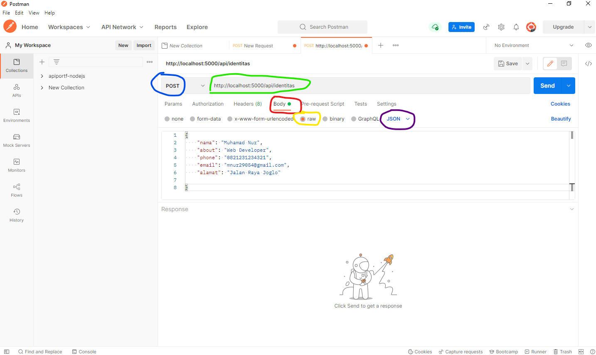
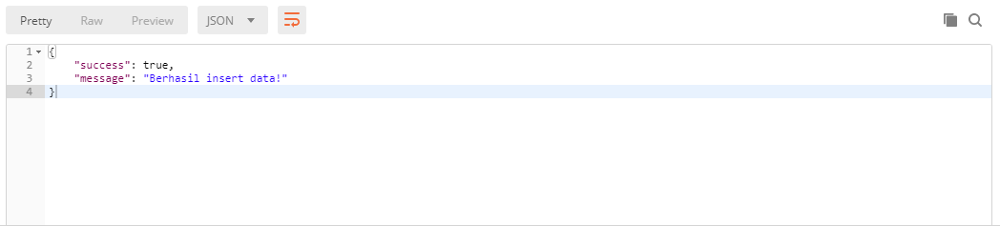
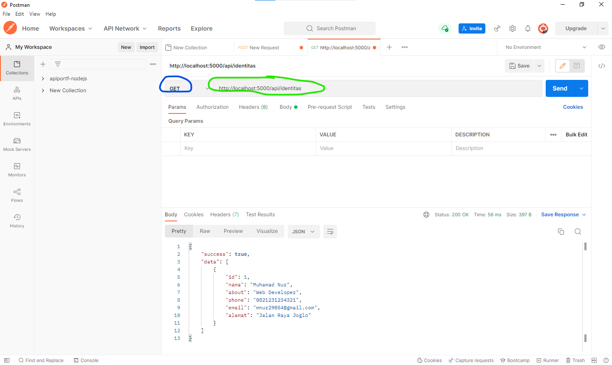
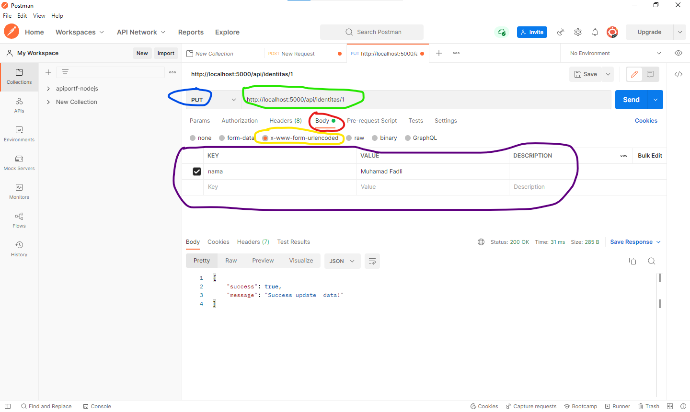
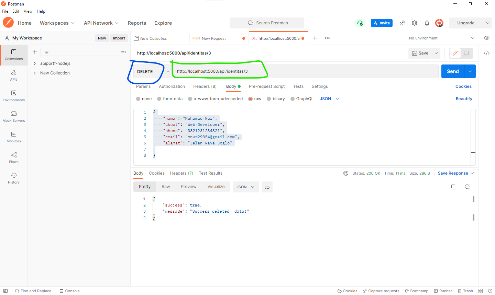

Hallo semuanya ini adalah postingan pertama saya di blog ini, sebenernya di blogger udah ada cuma saya pindah kesini aja, dan ini juga terkait tutorial saya yang ada di youtube

## Introduction

sesuai judul disini saya mau Membuat RESTful API menggunakan Node JS. Dan tutorial ini bakal saya buat jadi beberapa bagian supaya ga terlalu numpuk artikelnya. Jadi ikutin yuk tutorialnya pelan-pelan yahh!

> Disini saya anggap kalian udah paham ya tentang API itu apa, Node JS itu apa, juga Express itu apa, dan cara gunain MySQL. Jadi kalau belum paham saya saranin buat belajar dulu basicnya di tempat lain yaa!

Nahh, ada alat dan bahan yang perlu kita siapin juga nihh, yaitu :

- Pastinya udah install node.js, kalau belum install [disini](https://nodejs.org/en/download/)
- [Postman](https://www.postman.com/), alat tempur ini bakal dipakai buat test API yang udah kalian buat
- Visual Studio Code, saya saranin pakai code editor ini karena banyak banget plugin yang udah disediain untuk ngebantu proses pembuatan API ini
- Secangkir kopi, buat nemenin kalian biar nambah semangat belajarnya

## Configuration

Langsung aja yok kita masuk ke caranya!

Pertama, kita buat dulu projectnya dan kasih nama apa aja terserah kalian dehh. Lalu kita buka terminal yang ada di VSCode nya, terus kita ketik “npm init”

```bash
npm init
```

Disini kalian disuruh buat kasih nama projectnya, version, deskripsi, dll. Jadi silahkan isi terserah kalian aja. Buat case di artikel ini saya kasih nama backend.



Kalau udah init project kalian, nanti kalian bakalan dibuatin file package.json yang isinya buat nyimpen informasi package yang bakal kalian gunain di project api yang kita buat ini.

Nahh sekarang, kita install 3 package utama untuk membuat RESTful yaitu :

1. **express**
   Package ini simplenya adalah frameworknya node js yang bakal kita gunain untuk mempermudah routing kita nanti
2. **mysql**
   Package ini simplenya berfungsi untuk ngejalanin query-query SQL lewat fungsi yang bakal kita buat nanti
3. **body-parser**
   Package ini berfungsi untuk parsing setiap request yang kita kirim lewat HTTP, mau itu lewat x-www-form-urlencoded, raw json, dan form data.

Cara installnya, kalian tinggal ketik kode ini di terminal :

```bash
npm install express mysql body-parser
```

Kalau udah selesai install, sekarang kalian buat dulu databasenya. Terserah kalian mau dinamain apa studi kasus disini saya membuat nama databasenya dengan nama **api_nodejs**, terus kalian buat table dengan nama **identitas** dengan isian field kaya gini :



Atau biar cepet, saya juga sediain nih code nya :

```mysql
CREATE TABLE `identitas` (
  `id` int(11) NOT NULL,
  `nama` varchar(255) NOT NULL,
  `about` text NOT NULL,
  `phone` varchar(13) NOT NULL,
  `email` varchar(150) NOT NULL,
  `alamat` text NOT NULL
);
```

Kalau udah beres sama MySQL nya, sekarang kalian buat folder dan kasih nama **config**, lalu di dalam folder **config** ini kalian buat file dan kasih nama **database.js**. Kemudian kalian isi file tersebut dengan kode dibawah ini :

<div class="filename">database.js</div>

```javascript
const mysql = require("mysql");
// buat konfigurasi koneksi
const koneksi = mysql.createConnection({
  host: "host_kalian",
  user: "username_kalian",
  password: "password_kalian",
  database: "nama_database",
  multipleStatements: true,
});
// koneksi database
koneksi.connect((err) => {
  if (err) throw err;
  console.log("MySQL Connected...");
});
module.exports = koneksi;
```

> Isi host, user, pasword, dan nama database sesuai konfigurasi di local kalian ya!

Sekarang kalian buat file di luar folder config dan kasih nama **app.js**, lalu panggil package yang barusan kalian install dan kalian inisialisasi terlebih dahulu

<div class="filename">app.js</div>

```javascript
const express = require("express");
const bodyParser = require("body-parser");
const koneksi = require("./config/database");
const app = express();
const PORT = process.env.PORT || 5000;
// set body parser
app.use(bodyParser.json());
app.use(bodyParser.urlencoded({ extended: false }));
// buat server nya
app.listen(PORT, () => console.log(`Server running at port: ${PORT}`));
```

Nahh itu konfigurasi utamanya, sekarang kalian bisa buat fungsi CRUD nya nih. kalian mulai berurutan dari create data dulu

## Initial Setup

##### Created Data

Di dalam file **app.js** yang telah kalian buat, tambahkan kode ini dibawah set body parser, untuk tambah data ke database

<div class="filename">app.js</div>

```javascript
// set body parser
app.use(bodyParser.json());
app.use(bodyParser.urlencoded({ extended: false }));

// create data / insert data
app.post("/api/identitas", (req, res) => {
  // buat variabel penampung data dan query sql
  const data = { ...req.body };
  const querySql = "INSERT INTO identitas SET ?";

  // jalankan query
  koneksi.query(querySql, data, (err, rows, field) => {
    // error handling
    if (err) {
      return res
        .status(500)
        .json({ message: "Gagal insert data!", error: err });
    }

    // jika request berhasil
    res.status(201).json({ success: true, message: "Berhasil insert data!" });
  });
});

// buat server nya
app.listen(PORT, () => console.log(`Server running at port: ${PORT}`));
```

Kalau udah, kalian bisa save dulu filenya terus buka terminalnya lalu ketik **node app.js** terus enter. Kalau berhasil dan ga ada error nanti muncul kaya gini



Kalau ga ada error, silahkan kalian buka app **postman**, kemudian klik tab +. Dan ini data yang akan kalian kirim lewat HTTP yang nantinya bakal kalian insert ke database kalian.

```json
{
  "nama": "Muhamad Nur",
  "about": "Web Developer",
  "phone": "0821231234321",
  "email": "mnur29054@gmail.com",
  "alamat": "Jalan Raya Joglo"
}
```



Perhatikan bagian yang saya lingkari dengan warna yang berbeda.

1. **Biru**, method yang kita pakai. karena kita bakal insert data, jadi kita perlu gunain method POST
2. **Hijau**, URL API yang kita buat berdasarkan routing yang kita tentukan di code baris 6 pada fungsi create data diatas.
3. **Merah**, itu adalah body tempat untuk mengirimkan data lewat HTTP
4. **Kuning**, jenis si body. Disini saya pakai raw karena saya mau kirim data berupa JSON (JavaScript Object Notation)
5. **Ungu**,content type yang akan kita kirim. Kita pilih yang JSON yaa
   Kalau udah langsung aja klik **send**, dan kalau berhasil nanti dia bakal ngasih response kaya gini :



##### Read Data

Di dalam file **app.js**, tambahkan kode ini dibawah fungsi read data

```javascript
// read data / get data
app.get("/api/identitas", (req, res) => {
  // buat query sql
  const querySql = "SELECT * FROM identitas";

  // jalankan query
  koneksi.query(querySql, (err, rows, field) => {
    // error handling
    if (err) {
      return res.status(500).json({ message: "Ada kesalahan", error: err });
    }

    // jika request berhasil
    res.status(200).json({ success: true, data: rows });
  });
});
```

Kemudian kalian save filenya, lalu berhentikan dulu server yang sebelumnya kalian jalankan di terminal dengan **CTRL + C**. Lalu kalian jalankan lagi servernya dengan perintah **node app.js** sama seperti sebelumnya.

Setelah itu, kalian buka lagi app postman-nya lalu masukkan URL yang kalian buat berdasarkan routing yang kalian tentukan.



Disini saya pakai method GET karena kita mau ambil data dari server, dan kalau berhasil maka responsenya akan seperti gambar diatas (sesuai dengan yang kita buat)

##### Update Data

Di dalam file **app.js**, tambahkan kode ini dibawah fungsi update data

```javascript
// update data
app.put("/api/identitas/:id", (req, res) => {
  // buat variabel penampung data dan query sql
  const data = { ...req.body };
  const querySearch = "SELECT * FROM identitas WHERE id = ?";
  const queryUpdate = "UPDATE identitas SET ? WHERE id = ?";

  // jalankan query untuk melakukan pencarian data
  koneksi.query(querySearch, req.params.id, (err, rows, field) => {
    // error handling
    if (err) {
      return res.status(500).json({ message: "Ada kesalahan", error: err });
    }

    // jika id yang dimasukkan sesuai dengan data yang ada di db
    if (rows.length) {
      // jalankan query update
      koneksi.query(queryUpdate, [data, req.params.id], (err, rows, field) => {
        // error handling
        if (err) {
          return res.status(500).json({ message: "Ada kesalahan", error: err });
        }

        // jika update berhasil
        res
          .status(200)
          .json({ success: true, message: "Berhasil update data!" });
      });
    } else {
      return res
        .status(404)
        .json({ message: "Data tidak ditemukan!", success: false });
    }
  });
});
```

Kemudian kalian save terlebih dahulu filenya, lalu berhentikan lagi server yang sebelumnya kalian jalankan di terminal dengan **_CTRL + C_**. Lalu kalian jalankan lagi servernya dengan perintah **_node app.js_**.



Disini saya pakai method PUT, dan menggunakan jenis body **_x-www-form-urlencoded_**. Dan saya mau update nama nya aja dari salah satu data di table identitas dengan id = 1. Silahkan kalian lihat hasilnya di database kalian, kalau bener ngikutinnya gak akan error.

##### Delete Data

Di dalam file app.js, tambahkan kode ini dibawah fungsi delete data

```javascript
// delete data
app.delete("/api/identitas/:id", (req, res) => {
  // buat query sql untuk mencari data dan hapus
  const querySearch = "SELECT * FROM identitas WHERE id = ?";
  const queryDelete = "DELETE FROM identitas WHERE id = ?";

  // jalankan query untuk melakukan pencarian data
  koneksi.query(querySearch, req.params.id, (err, rows, field) => {
    // error handling
    if (err) {
      return res.status(500).json({ message: "Ada kesalahan", error: err });
    }

    // jika id yang dimasukkan sesuai dengan data yang ada di db
    if (rows.length) {
      // jalankan query delete
      koneksi.query(queryDelete, req.params.id, (err, rows, field) => {
        // error handling
        if (err) {
          return res.status(500).json({ message: "Ada kesalahan", error: err });
        }

        // jika delete berhasil
        res
          .status(200)
          .json({ success: true, message: "Berhasil hapus data!" });
      });
    } else {
      return res
        .status(404)
        .json({ message: "Data tidak ditemukan!", success: false });
    }
  });
});
```

Sama kaya sebelumnya yah, berhentiin dulu servernya lalu kalian jalankan lagi servernya. Lalu buka Posman nya dan sesuaikan konfigurasinya kaya gini :



Disini saya pakai method DELETE karena kita mau hapus data, dan kalau berhasil maka responsenya akan seperti gambar diatas (sesuai dengan yang kalian buat)

Nahh sampai sini dulu yahh artikel Restful API nya, di bagian selanjutnya nanti kita bakal buat MC Pattern nya (Model Controller) dimana nanti kita bakal membiasakan ngoding terstruktur dengan file yang dipisah-pisah sesuai kebutuhannya, agar terlihat rapih dalam menulis code.

Semoga bermanfaat yaa,
